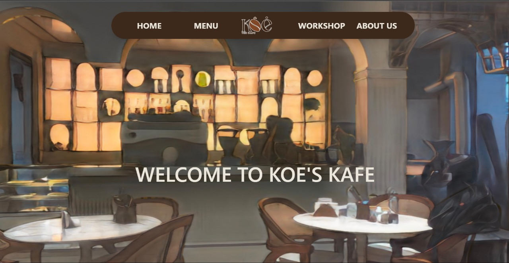
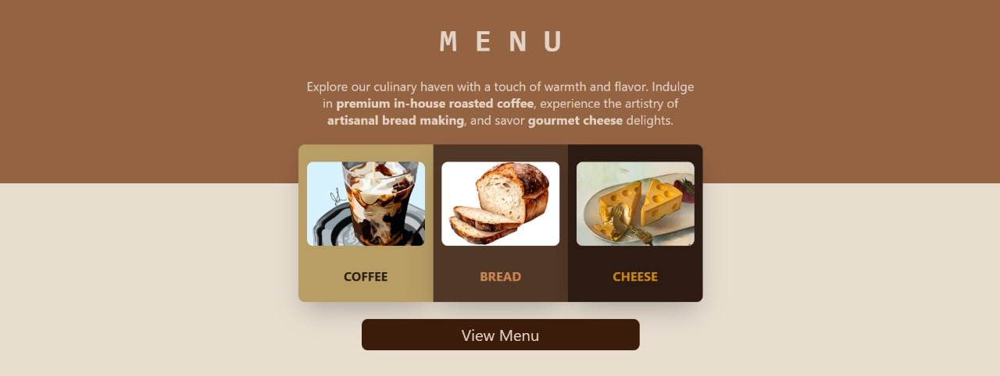
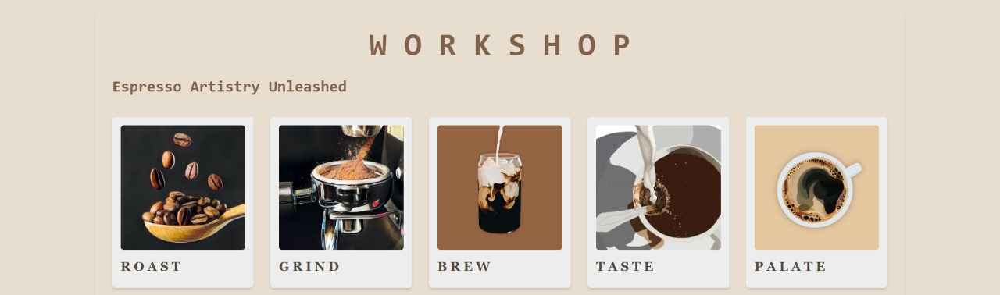
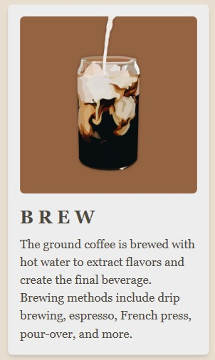
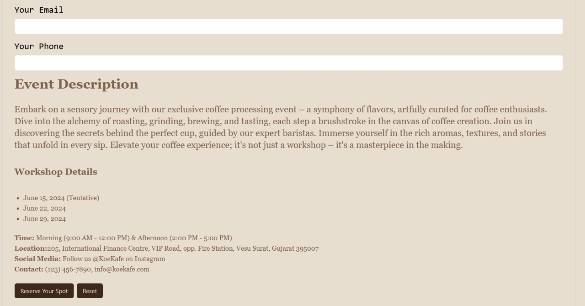
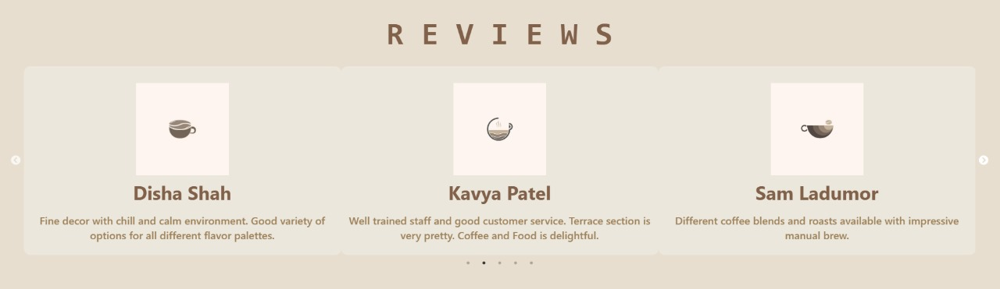
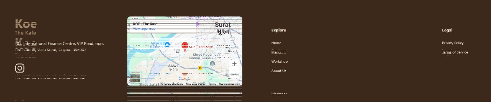

# brew ☕  
a website for koe’s cafe - where design meets coffee and code.

---

## what it is  
a fully responsive single-page site for a local cafe in surat,  
built with react.js and styled using tailwind css.  
featuring menus, upcoming workshops, and a warm, welcoming digital vibe.

---

## my part  
i led the ui/ux from layout to color language,  
and designed the custom graphics, menu visuals, and aesthetic flow  
to reflect the cozy, handwritten charm of the actual cafe.

---

## design snapshots 
visuals created for the koe’s cafe experience ↓

## design snapshots 
handcrafted visuals for koe’s cafe digital space ↓

  
  
  

  
  
  

  

---

## timeline  
- explored the cafe and its story  
- brainstormed moodboards + design themes  
- pitched ideas to the cafe owners  
- built components collaboratively  
- integrated visuals and finalized styles  

---

## tech stack  
- react.js  
- tailwind css  
- github pages

---

*design that smells like coffee.* 
